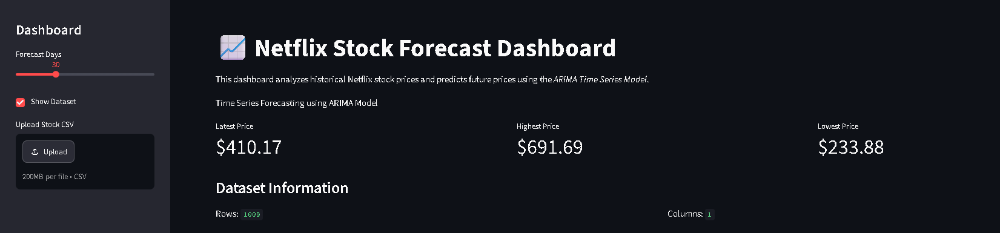
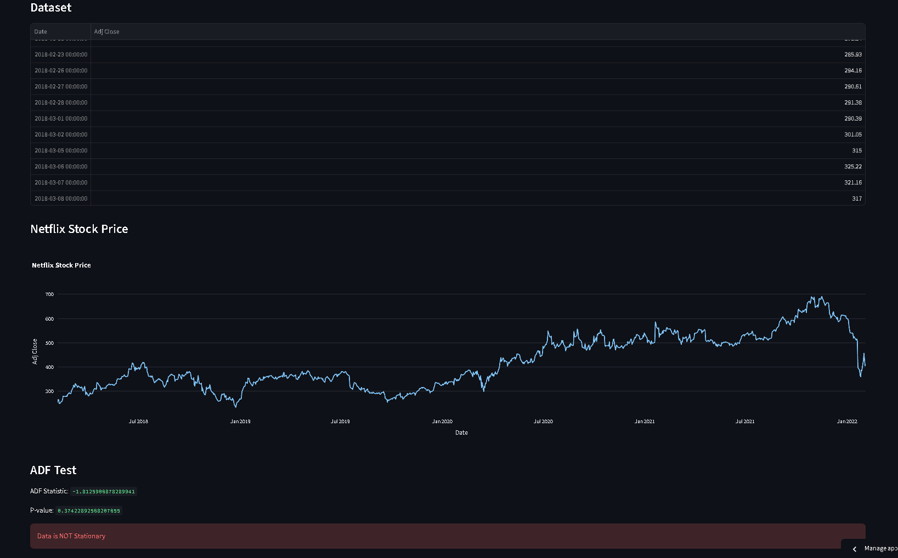
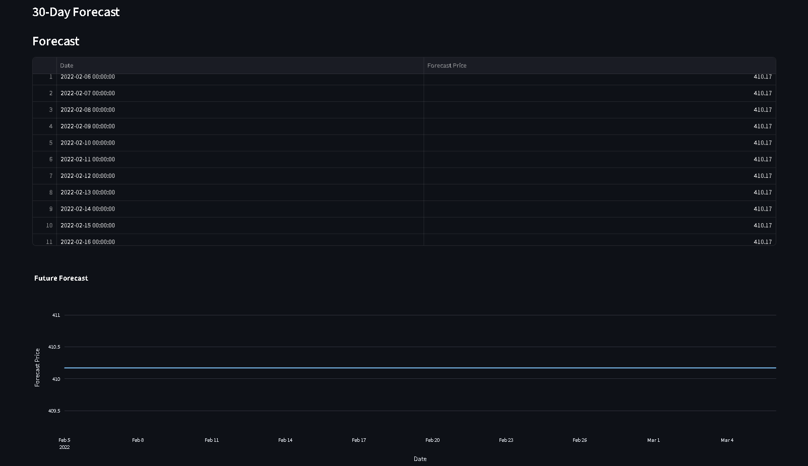

# netflix-stock-forecasting
# 📈 Netflix Stock Price Forecasting Dashboard

An interactive data analytics dashboard that analyzes historical Netflix stock prices and forecasts future prices using the ARIMA Time Series Forecasting model.

This project demonstrates data preprocessing, visualization, statistical analysis, and forecasting through a user-friendly Streamlit interface.

---
## 📸 Application Screenshots

### 🏠 Dashboard
The main dashboard displays key stock metrics, dataset information, and controls for forecasting.

---

### 📈 Interactive Stock Price Chart
Interactive visualization of historical Netflix stock prices, allowing users to analyze trends over time.

---

### 🔮 Future Forecast
Forecasted Netflix stock prices generated using the ARIMA Time Series model.

